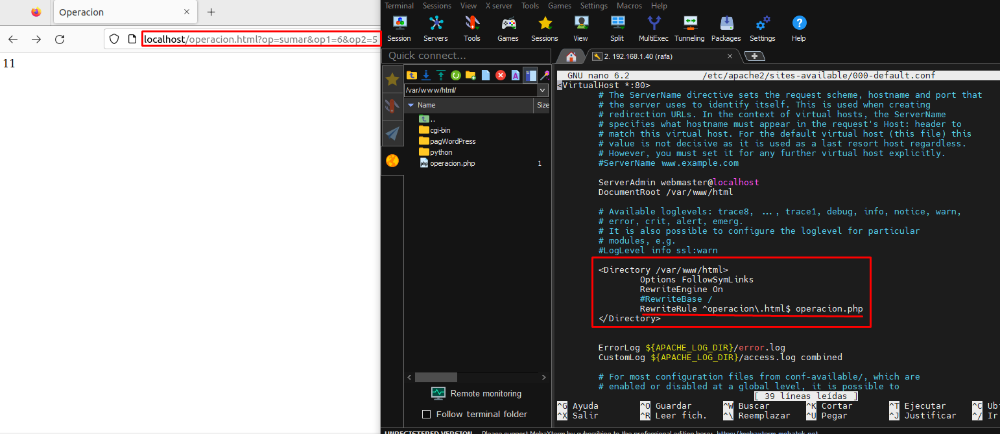
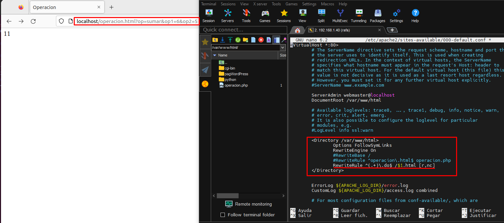

## Participantes
- Rafael Hinestrosa
- Esteban Domínguez
- Adrian Lopez
- Nicolae Adrian

# Ejercicio 1: Reescribir URL
Creamos un fichero php llamado [operacion.php](operacion.php). Queremos reescribir la URL con .html en vez de .php, para ello debemos hacer lo siguiente

# Ejercicio 2: Cambiar la extensión de los ficherosPermalink
Ahora vamos a modificar nuestro RewriteRule para poder acceder al archivo tanto con un .do como con .html, para ello debemos hacer lo siguiente

Para acceder a .html

Para acceder a .do

